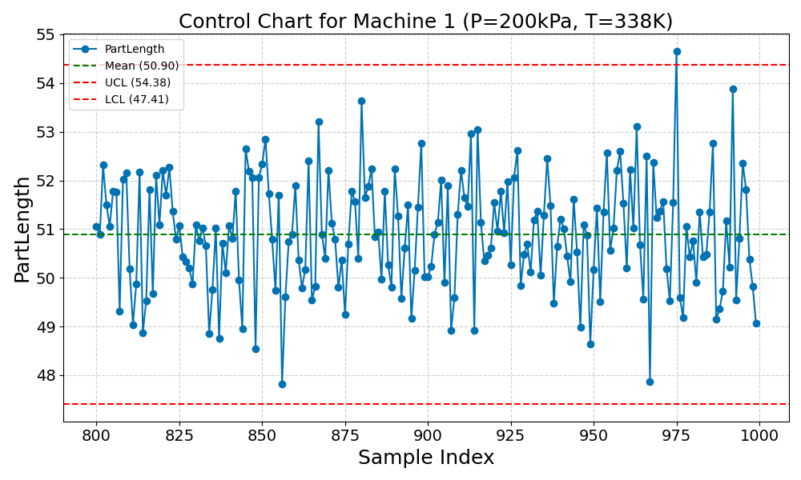
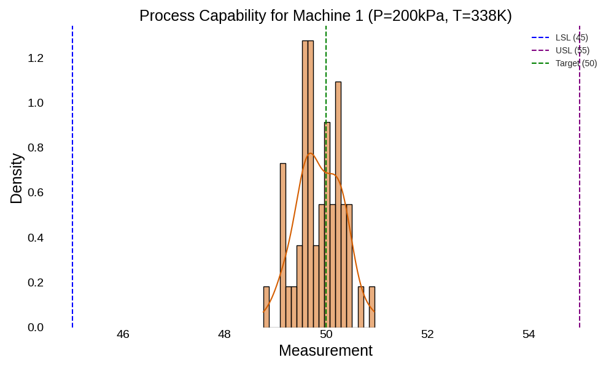
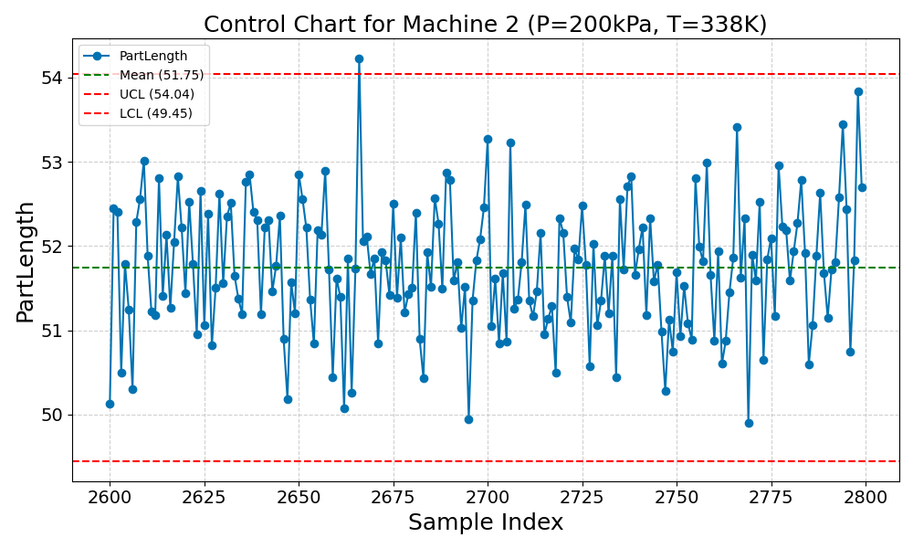
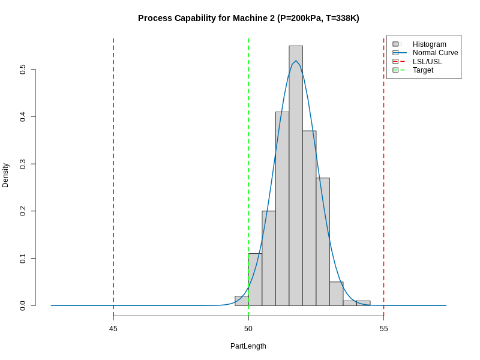
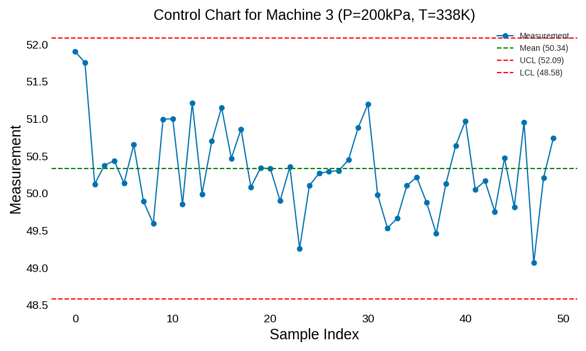
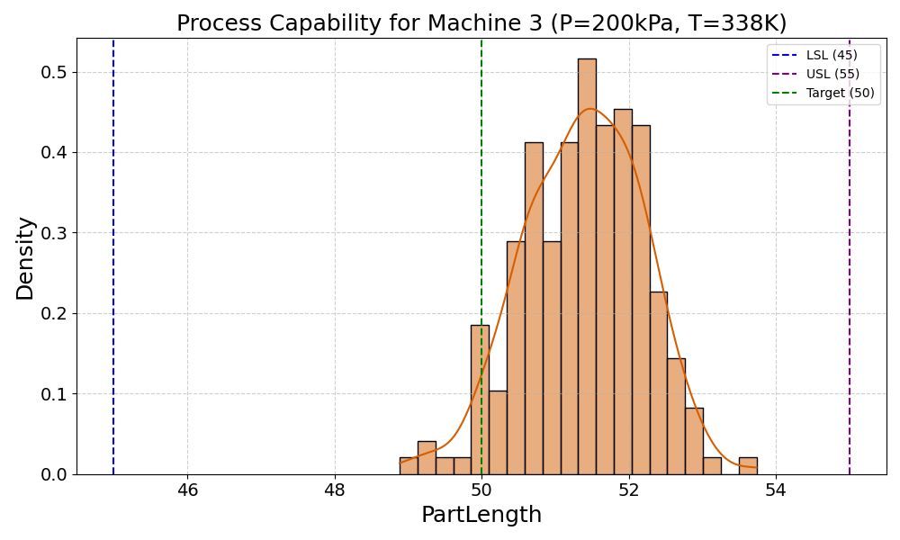
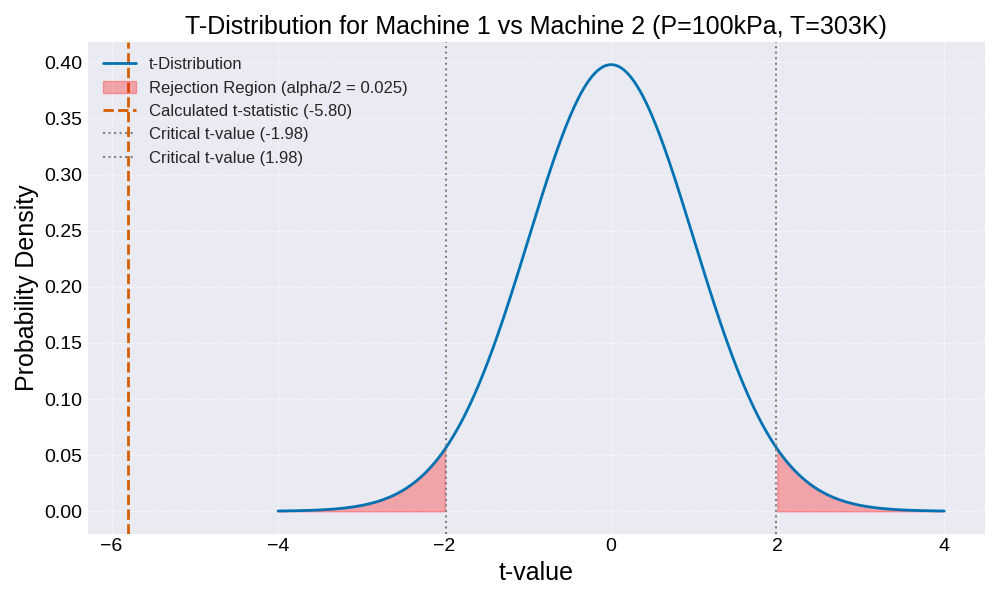
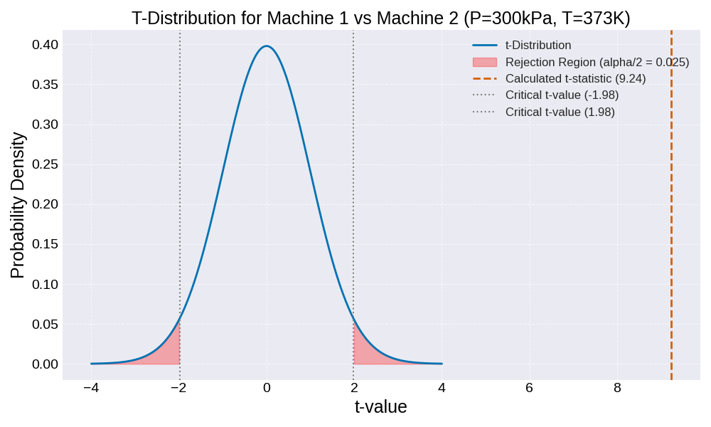
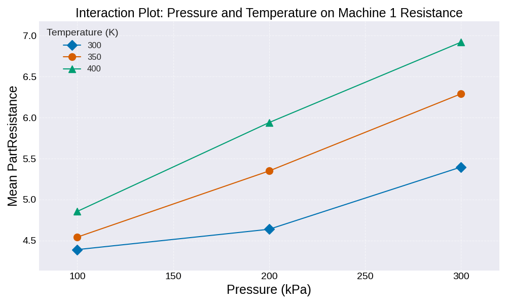

:::: {.columns}
::: {.column width="50%"}

## Sample slides
#### PlaceHolderName
#### Universiti Malaysia Perlis
#### [placeholder@email.com](mailto:placeholder@email.com)


:::

::: {.column width="50%"}

:::

::::

---

:::: {.columns}
::: {.column width="50%"}
### Slide one
**Key Concepts:**
- Energy conservation per @carnot1824.
- $\Delta U = Q - W$
:::

::: {.column width="50%"}

:::
::::

---

<span class="slide-title" data-title="My Hidden Slide Name"></span>


---

:::: {.columns}
::: {.column width="50%"}
### The Master Equation
The fundamental relation of thermodynamics:

$$\Delta U = Q - W$$

The work done $W$ is positive when the system expands against an external pressure.
:::

::: {.column width="50%"}
<video data-src="media/videos/sample.mp4" data-autoplay loop muted width="100%"></video>
:::

::::

---

:::: {.columns}
::: {.column width="50%"}
### Visualizing the Gas Law
**Interactive Model:**

- P, V, and T relationships.
- Use the slider to adjust pressure.
- Observe the phase boundary.
:::

::: {.column width="50%"}
<iframe 
  data-src="media/plots/sample.html" 
  width="100%" 
  height="500px" 
  style="border:none;" 
  scrolling="no">
</iframe>
:::
::::

----

:::: {.columns}
::: {.column width="50%"}
### Control Chart for Machine 1 (P=200kPa, T=338K)

<p>The control chart for Machine 1 shows the PartLength over time.</p>

:::

::: {.column width="50%"}
<iframe data-src='media/plots/control_chart_machine_1_P200_T338.html' width='100%' height='500px' style='border:none;'></iframe>
<!-- Replace with actual plot image if direct html widget is not possible for qcc -->
:::

::::

----

:::: {.columns}
::: {.column width="50%"}
### Process Capability Chart for Machine 1 (P=200kPa, T=338K)

<p>This chart visualizes the process capability of Machine 1 against the specified limits.</p>

:::

::: {.column width="50%"}
<iframe data-src='media/plots/process_capability_machine_1_P200_T338.html' width='100%' height='500px' style='border:none;'></iframe>
:::

::::

----

### Cpk for Machine 1 (P=200kPa, T=338K)

```{r}
# Filter data for Machine 1, Pressure = 200kPa, Temp = 338K
data_m1 <- subset(X011, Machine == 1 & Pressure == 200 & Temperature == 338)

LSL = 45
USL = 55
TARGET = 50

# Create a qcc object for capability analysis
qcc_obj_m1_cap <- qcc(data_m1$PartLength, type="xbar.one", plot=FALSE)

# Process Capability Analysis
pc_m1 <- process.capability(qcc_obj_m1_cap, spec.limits=c(LSL, USL), target=TARGET, plot=FALSE)

# Extract Cpk value
cpk_m1 <- round(pc_m1$cpk, 4)

cat("Cpk for Machine 1 (P=200kPa, T=338K): ", cpk_m1)
```

:::

::::

----

### Machine 1 Capability Evaluation

<p>To evaluate if Machine 1 is capable under these conditions, we consider the Cpk value. A Cpk value of 1.33 or higher generally indicates a capable process, while a Cpk between 1.0 and 1.33 suggests the process is adequate but may require close monitoring. A Cpk below 1.0 indicates the process is not capable.</p>

<p>Based on the calculated Cpk for Machine 1 (refer to Slide 3 for the specific value), we can determine its capability:</p>

<ul>
  <li>If Cpk is >= 1.33: Machine 1 is **capable**.</li>
  <li>If Cpk is between 1.0 and 1.33: Machine 1 is **adequate**.</li>
  <li>If Cpk is < 1.0: Machine 1 is **not capable**.</li>
</ul>

:::

::::

----

:::: {.columns}
::: {.column width="50%"}
### Control Chart for Machine 2 (P=200kPa, T=338K)

<p>The control chart for Machine 2 shows the PartLength over time.</p>

:::

::: {.column width="50%"}
<iframe data-src='media/plots/control_chart_machine_2_P200_T338.html' width='100%' height='500px' style='border:none;'></iframe>
:::

::::

----

:::: {.columns}
::: {.column width="50%"}
### Process Capability Chart for Machine 2 (P=200kPa, T=338K)

<p>This chart visualizes the process capability of Machine 2 against the specified limits.</p>

:::

::: {.column width="50%"}
<iframe data-src='media/plots/process_capability_machine_2_P200_T338.html' width='100%' height='500px' style='border:none;'></iframe>
:::

::::

----

### Cpk for Machine 2 (P=200kPa, T=338K)

```{r}
# Filter data for Machine 2, Pressure = 200kPa, Temp = 338K
data_m2 <- subset(X011, Machine == 2 & Pressure == 200 & Temperature == 338)

LSL = 45
USL = 55
TARGET = 50

# Create a qcc object for capability analysis
qcc_obj_m2_cap <- qcc(data_m2$PartLength, type="xbar.one", plot=FALSE)

# Process Capability Analysis
pc_m2 <- process.capability(qcc_obj_m2_cap, spec.limits=c(LSL, USL), target=TARGET, plot=FALSE)

# Extract Cpk value
cpk_m2 <- round(pc_m2$cpk, 4)

cat("Cpk for Machine 2 (P=200kPa, T=338K): ", cpk_m2)
```

:::

::::

----

### Machine 2 Capability Evaluation

<p>To evaluate if Machine 2 is capable under these conditions, we consider the Cpk value. A Cpk value of 1.33 or higher generally indicates a capable process, while a Cpk between 1.0 and 1.33 suggests the process is adequate but may require close monitoring. A Cpk below 1.0 indicates the process is not capable.</p>

<p>Based on the calculated Cpk for Machine 2 (refer to Slide 7 for the specific value), we can determine its capability:</p>

<ul>
  <li>If Cpk is >= 1.33: Machine 2 is **capable**.</li>
  <li>If Cpk is between 1.0 and 1.33: Machine 2 is **adequate**.</li>
  <li>If Cpk is < 1.0: Machine 2 is **not capable**.</li>
</ul>

:::

::::

----

:::: {.columns}
::: {.column width="50%"}
### Control Chart for Machine 3 (P=200kPa, T=338K)

<p>The control chart for Machine 3 shows the PartLength over time.</p>

:::

::: {.column width="50%"}
<iframe data-src='media/plots/control_chart_machine_3_P200_T338.html' width='100%' height='500px' style='border:none;'></iframe>
:::

::::

----

:::: {.columns}
::: {.column width="50%"}
### Process Capability Chart for Machine 3 (P=200kPa, T=338K)

<p>This chart visualizes the process capability of Machine 3 against the specified limits.</p>

:::

::: {.column width="50%"}
<iframe data-src='media/plots/process_capability_machine_3_P200_T338.html' width='100%' height='500px' style='border:none;'></iframe>
:::

::::

----

### Cpk for Machine 3 (P=200kPa, T=338K)

```{r}
# Filter data for Machine 3, Pressure = 200kPa, Temp = 338K
data_m3 <- subset(X011, Machine == 3 & Pressure == 200 & Temperature == 338)

LSL = 45
USL = 55
TARGET = 50

# Create a qcc object for capability analysis
qcc_obj_m3_cap <- qcc(data_m3$PartLength, type="xbar.one", plot=FALSE)

# Process Capability Analysis
pc_m3 <- process.capability(qcc_obj_m3_cap, spec.limits=c(LSL, USL), target=TARGET, plot=FALSE)

# Extract Cpk value
cpk_m3 <- round(pc_m3$cpk, 4)

cat("Cpk for Machine 3 (P=200kPa, T=338K): ", cpk_m3)
```

:::

::::

----

### Machine 3 Capability Evaluation

<p>To evaluate if Machine 3 is capable under these conditions, we consider the Cpk value. A Cpk value of 1.33 or higher generally indicates a capable process, while a Cpk between 1.0 and 1.33 suggests the process is adequate but may require close monitoring. A Cpk below 1.0 indicates the process is not capable.</p>

<p>Based on the calculated Cpk for Machine 3 (refer to Slide 11 for the specific value), we can determine its capability:</p>

<ul>
  <li>If Cpk is >= 1.33: Machine 3 is **capable**.</li>
  <li>If Cpk is between 1.0 and 1.33: Machine 3 is **adequate**.</li>
  <li>If Cpk is < 1.0: Machine 3 is **not capable**.</li>
</ul>

:::

::::

----

:::: {.columns}
::: {.column width="50%"}
### Control Chart for Machine 1 (P=200kPa, T=338K)

<p>The control chart for Machine 1 shows the PartLength over time.</p>

:::

::: {.column width="50%"}

:::

::::

----

:::: {.columns}
::: {.column width="50%"}
### Process Capability Chart for Machine 1 (P=200kPa, T=338K)

<p>This chart visualizes the process capability of Machine 1 against the specified limits.</p>

:::

::: {.column width="50%"}

:::

::::

----

### Cpk for Machine 1 (P=200kPa, T=338K)

<p>The Cpk value for Machine 1 under these conditions is: **1.1789**</p>

----

### Machine 1 Capability Evaluation

<p>To evaluate if Machine 1 is capable under these conditions, we consider the Cpk value. A Cpk value of 1.33 or higher generally indicates a capable process, while a Cpk between 1.0 and 1.33 suggests the process is adequate but may require close monitoring. A Cpk below 1.0 indicates the process is not capable.</p>

<p>Based on the calculated Cpk for Machine 1 (1.1789), we can determine its capability:</p>

<ul>
  <li>If Cpk is >= 1.33: Machine 1 is **capable**.</li>
  <li>If Cpk is between 1.0 and 1.33: Machine 1 is **adequate**.</li>
  <li>If Cpk is < 1.0: Machine 1 is **not capable**.</li>
</ul>


----

:::: {.columns}
::: {.column width="50%"}
### Control Chart for Machine 2 (P=200kPa, T=338K)

<p>The control chart for Machine 2 shows the PartLength over time.</p>

:::

::: {.column width="50%"}

:::

::::

----

:::: {.columns}
::: {.column width="50%"}
### Process Capability Chart for Machine 2 (P=200kPa, T=338K)

<p>This chart visualizes the process capability of Machine 2 against the specified limits.</p>

:::

::: {.column width="50%"}

:::

::::

----

### Cpk for Machine 2 (P=200kPa, T=338K)

<p>The Cpk value for Machine 2 under these conditions is: **1.4182**</p>

----

### Machine 2 Capability Evaluation

<p>To evaluate if Machine 2 is capable under these conditions, we consider the Cpk value. A Cpk value of 1.33 or higher generally indicates a capable process, while a Cpk between 1.0 and 1.33 suggests the process is adequate but may require close monitoring. A Cpk below 1.0 indicates the process is not capable.</p>

<p>Based on the calculated Cpk for Machine 2 (1.4182), we can determine its capability:</p>

<ul>
  <li>If Cpk is >= 1.33: Machine 2 is **capable**.</li>
  <li>If Cpk is between 1.0 and 1.33: Machine 2 is **adequate**.</li>
  <li>If Cpk is < 1.0: Machine 2 is **not capable**.</li>
</ul>


----

:::: {.columns}
::: {.column width="50%"}
### Control Chart for Machine 3 (P=200kPa, T=338K)

<p>The control chart for Machine 3 shows the PartLength over time.</p>

:::

::: {.column width="50%"}

:::

::::

----

:::: {.columns}
::: {.column width="50%"}
### Process Capability Chart for Machine 3 (P=200kPa, T=338K)

<p>This chart visualizes the process capability of Machine 3 against the specified limits.</p>

:::

::: {.column width="50%"}

:::

::::

----

### Cpk for Machine 3 (P=200kPa, T=338K)

<p>The Cpk value for Machine 3 under these conditions is: **1.5029**</p>

----

### Machine 3 Capability Evaluation

<p>To evaluate if Machine 3 is capable under these conditions, we consider the Cpk value. A Cpk value of 1.33 or higher generally indicates a capable process, while a Cpk between 1.0 and 1.33 suggests the process is adequate but may require close monitoring. A Cpk below 1.0 indicates the process is not capable.</p>

<p>Based on the calculated Cpk for Machine 3 (1.5029), we can determine its capability:</p>

<ul>
  <li>If Cpk is >= 1.33: Machine 3 is **capable**.</li>
  <li>If Cpk is between 1.0 and 1.33: Machine 3 is **adequate**.</li>
  <li>If Cpk is < 1.0: Machine 3 is **not capable**.</li>
</ul>


----

### Slide 13: T-Test Distribution Curve (P=100kPa, T=303K)

:::: {.columns}
::: {.column width="50%"}
<p>This plot shows the t-distribution curve for the comparison between Machine 1 and Machine 2 under the condition of Pressure = 100kPa and Temperature = 303K.</p>
<p>The calculated t-statistic is marked, along with the critical rejection regions (red shaded areas) for a significance level of alpha = 0.05.</p>
:::

::: {.column width="50%"}

:::

::::

----

### Slide 14: T-Test Results (P=100kPa, T=303K)

:::: {.columns}
::: {.column width="50%"}
<h4>P-value and T-statistic</h4>
<ul>
  <li><strong>Calculated T-statistic:</strong> -5.7985</li>
  <li><strong>P-value:</strong> 0.0000</li>
</ul>
<p><em>(A p-value less than alpha=0.05 indicates statistical significance.)</em></p>
:::

::: {.column width="50%"}
```python
t_statistic = -5.7985
p_value = 0.0000
alpha = 0.05
```
:::

::::

----

### Slide 15: True Difference Evaluation (P=100kPa, T=303K)

:::: {.columns}
::: {.column width="50%"}
<h4>Is there a true difference?</h4>
<p>Based on the independent two-sample t-test at a significance level of alpha = 0.05:</p>
<ul>
  <li><strong>Conclusion:</strong> Yes</li>
</ul>
<p>Since the p-value (0.0000) is less than alpha (0.05), we reject the null hypothesis. This means there is statistically significant difference in the mean measurements between Machine 1 and Machine 2 under these conditions.</p>
:::

::: {.column width="50%"}
```python
p_value = 0.0000
alpha = 0.05
is_true_difference = 'Yes'
```
:::

::::

----

### Slide 16: T-Test Distribution Curve (P=300kPa, T=373K)

:::: {.columns}
::: {.column width="50%"}
<p>This plot shows the t-distribution curve for the comparison between Machine 1 and Machine 2 under the condition of Pressure = 300kPa and Temperature = 373K.</p>
<p>The calculated t-statistic is marked, along with the critical rejection regions (red shaded areas) for a significance level of alpha = 0.05.</p>
:::

::: {.column width="50%"}

:::

::::

----

### Slide 17: T-Test Results (P=300kPa, T=373K)

:::: {.columns}
::: {.column width="50%"}
<h4>P-value and T-statistic</h4>
<ul>
  <li><strong>Calculated T-statistic:</strong> 9.2357</li>
  <li><strong>P-value:</strong> 0.0000</li>
</ul>
<p><em>(A p-value less than alpha=0.05 indicates statistical significance.)</em></p>
:::

::: {.column width="50%"}
```python
t_statistic = 9.2357
p_value = 0.0000
alpha = 0.05
```
:::

::::

----

### Slide 18: True Difference Evaluation (P=300kPa, T=373K)

:::: {.columns}
::: {.column width="50%"}
<h4>Is there a true difference?</h4>
<p>Based on the independent two-sample t-test at a significance level of alpha = 0.05:</p>
<ul>
  <li><strong>Conclusion:</strong> Yes</li>
</ul>
<p>Since the p-value (0.0000) is less than alpha (0.05), we reject the null hypothesis. This means there is statistically significant difference in the mean measurements between Machine 1 and Machine 2 under these conditions.</p>
:::

::: {.column width="50%"}
```python
p_value = 0.0000
alpha = 0.05
is_true_difference = 'Yes'
```
:::

::::

----

### Slide 19: ANOVA for Pressure (P) on Machine 1 Resistance

:::: {.columns}
::: {.column width="50%"}
#### ANOVA Results for Pressure
<p>The p-value for Pressure is <strong>0.0000</strong>.</p>
<p>Is this factor (Pressure) significant for Machine 1's Resistance? <strong>Yes</strong></p>

<p><em>(Refer to the full ANOVA table above for complete details.)</em></p>

:::

::: {.column width="50%"}
```
                   PR(>F)
C(Pressure)  9.387812e-49
```
:::

::::

----

### Slide 20: ANOVA for Temperature (T) on Machine 1 Resistance

:::: {.columns}
::: {.column width="50%"}
#### ANOVA Results for Temperature
<p>The p-value for Temperature is <strong>0.0000</strong>.</p>
<p>Is this factor (Temperature) significant for Machine 1's Resistance? <strong>Yes</strong></p>

<p><em>(Refer to the full ANOVA table above for complete details.)</em></p>
:::

::: {.column width="50%"}
```
                      PR(>F)
C(Temperature)  1.485842e-36
```
:::

::::

----

### Slide 21: ANOVA for Pressure*Temperature (P*T) Interaction on Machine 1 Resistance

:::: {.columns}
::: {.column width="50%"}
#### ANOVA Results for Pressure*Temperature Interaction
<p>The p-value for the Pressure*Temperature interaction is <strong>0.0000</strong>.</p>
<p>Is this interaction significant for Machine 1's Resistance? <strong>Yes</strong></p>

<p><em>(Refer to the full ANOVA table above for complete details.)</em></p>
:::

::: {.column width="50%"}
```
                                  PR(>F)
C(Pressure):C(Temperature)  2.907521e-13
```
:::

::::

----

### Slide 22: Interaction Plot: Pressure and Temperature on Machine 1 Resistance

:::: {.columns}
::: {.column width="50%"}
<p>This plot visually represents how the mean PartResistance changes across different levels of Pressure and Temperature, illustrating their interaction effect. Non-parallel lines suggest an interaction.</p>
:::

::: {.column width="50%"}

:::

::::

---
# Bibliography
<div id="refs"></div>
